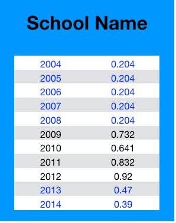
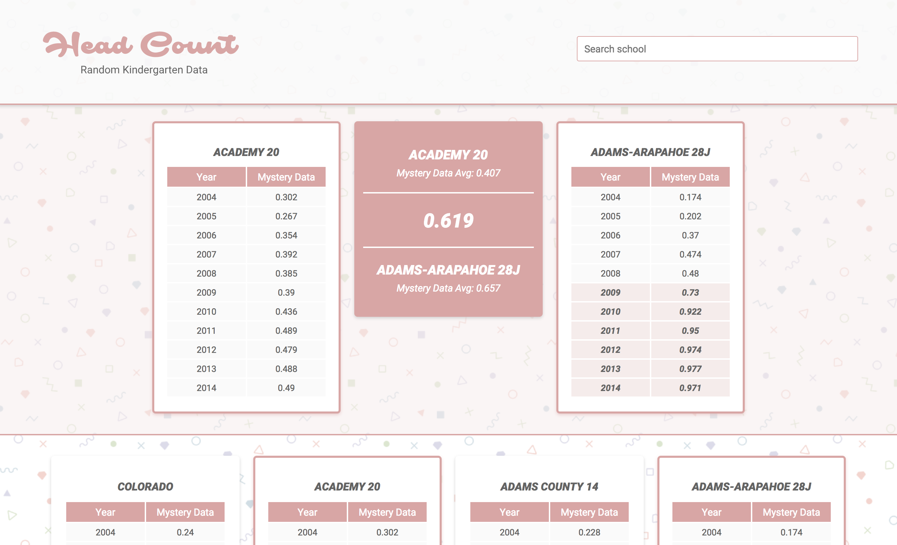

# HeadCount 2.0

HeadCount 2.0 is an app designed to display individual school data.  It has search functionality, allowing users to search for specific schools that reside in the database.  Users are also able to compare the average data from two different schools.  This data is displayed on screen with the respective schools on either side.


## Getting Started

These instructions will get you a copy of the project up and running on your local machine for development and testing purposes. See deployment for notes on how to deploy the project on a live system.


### Installing

A step by step series of examples that tell you have to get a development env running

Say what the step will be

```
Clone the repository (git clone https://github.com/tmcjunkinmarquis/headcount2.0.git).
```
```
npm install
```

## Running the tests

In the terminal, 

```
npm test
```

## Built With

* [Creat-React-App](https://github.com/facebook/create-react-app) - The web framework used

## Authors

* **David Daugherty** - *Initial work* - [daughedm](https://github.com/daughedm)
* **Seamus Quinn** - *Initial work* - [seamus-quinn](https://github.com/seamus-quinn)
* **Theresa Marquis** - *Initial work* - [tmcjunkinmarquis](https://github.com/tmcjunkinmarquis)
